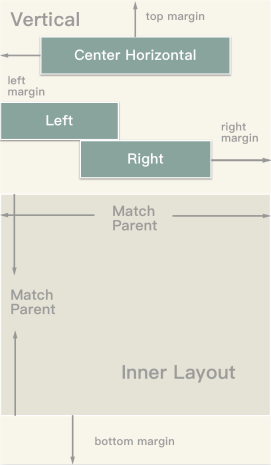
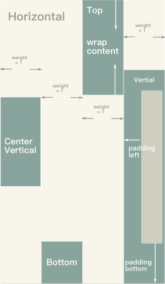
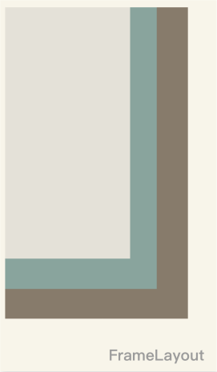
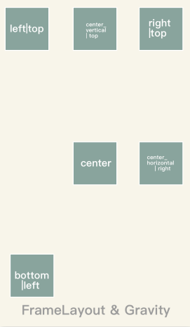
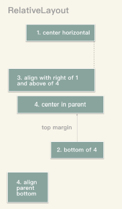

# JustUiKit
JustUiKit是一套Android样式工具iOS UI套件。 JustUiKit包含JustLinearLayout，JustFrameLayout, JustRelativeLayout等。 它旨在使Android开发人员轻松构建iOS UI。 也为iOS开发人员提供了一种新的方式来构建UI。

[](https://raw.githubusercontent.com/lfkdsk/JustUiKit/master/LICENSE)
[](https://github.com/lfkdsk/JustUiKit)
[](https://github.com/lfkdsk/JustUiKit)
[](https://cocoapods.org/pods/JustUiKit)

## 如何使用?

* 拷贝代码

​       拷贝Deomo中的JustUiKit代码到项目

* 使用 CocoaPods 安装

  CocoaPods是Objective-C / Swift的依赖项管理器，它自动化和简化在项目中使用第三方库（如TangramKit）的过程。 您可以使用以下命令安装它：

  `$ sudo gem install cocoapods`

  要使用CocoaPods将TangramKit集成到您的Xcode项目中，请在Podfile中指定：

  ```ruby
  platform :ios, '8.0'
  pod 'JustUiKit', '~> 0.1.4'
  ```

  之后运行如下命令:

  `$ pod install`

## 快捷开始

### JustLinearLayout
将其子代排列在单列或单行中的布局。 行的方向可以通过方向设置。 您还可以指定gravity，它通过设置重力指定所有子元素的对齐方式，或通过设置LinearLayoutParams的weight成员来指定特定子项增长以填充布局中的任何剩余空间。 默认方向为水平。

#### Gravity & Margin & Orientation
  

您可以设置重力以使视图布局在parentView的指定空间。 还设置Margin将在视图的四个方向保留空格。 在默认情况下，LinearLayout布局子项在水平方向，并且可以将其更改为Veritcal。

``` swift
let parentView = JustLinearLayout(frame: UIScreen.main.bounds, orientation: .Vertical)
let params = LinearLayoutParams(
                width: LayoutParams.WRAP_CONTENT,
                height: LayoutParams.WRAP_CONTENT)
let centerParams = LinearLayoutParams(params)
centerParams.layoutGravity = Gravity.Horizontal.getValue()

let marginParams = LinearLayoutParams(params)
marginParams.topMargin = 10

parentView.addView(createView(), centerParams)
parentView.addView(createView(), marginParams)
```

#### Padding & weight
  

使用Padding在四个方向，您可以保留视图的内部空间。 “权重”描述了子视图的位置。 默认为Gravity.TOP | Gravity.LEFT。 如果此布局具有VERTICAL方向，则控制在存在额外垂直空间时放置所有子视图的位置。 如果此布局具有HORIZONTAL方向，则控制子项的对齐方式。

``` swift
let parentView = JustLinearLayout(frame: UIScreen.main.bounds, orientation: .Vertical)
let params = LinearLayoutParams(
                width: LayoutParams.WRAP_CONTENT,
                height: LayoutParams.WRAP_CONTENT)
params.weight = 1
let paddingParams = LinearLayoutParams(params)
paddingParams.paddingTop = 10
parentView.addView(createView(), params)
parentView.addView(createView(), paddingParams)
```

### JustFrameLayout

FrameLayout设计用于屏蔽屏幕上的一个区域以显示单个项目。

通常，FrameLayout应该用于保存单个子视图，因为可能难以以可扩展到不同屏幕尺寸的方式组织子视图，而不会使子节点相互重叠。

然而，您可以添加多个孩子到一个FrameLayout，并通过分配重力给每个孩子，使用layoutGravity控制他们在FrameLayout中的位置。

#### Overlap on left


如果不使用任何边距或填充来更改视图的位置。 所有的视图将添加像堆栈和重叠在屏幕的左边|顶部。

Example:

``` swift
let parentView: JustFrameLayout = JustFrameLayout(width:MATCH_PARENT, height:MATCH_PARENT)
let params: FrameLayoutParams = JustFrameLayoutParams(width: WRAP_CONTENT, height: WRAP_CONTENT)
parentView.addView(createView(rgb:0xE4E1D8), params)
parentView.addView(createView(rgb:0x89A49D), params)
parentView.addView(createView(rgb:0x877B6B), params)
```

#### Layout With Gravity


您可以使用水平和垂直重力。 此外，您可以使用像left | bottom，center_horizontal | center_vertical来同时使用它们。

Example:

``` swift
let parentView: FrameLayout = FrameLayout(width:MATCH_PARENT, height:MATCH_PARENT)
let params: FrameLayoutParams = FrameLayoutParams(width: WRAP_CONTENT, height: WRAP_CONTENT)

let b_l = FrameLayoutParams(params)
b_l.layoutGravity = Gravity.BOTTOM | Gravity.TOP
let c_r = FrameLayoutParams(params)
c_r.layoutGravity = Gravity.CENTER_HORIZONTAL | Gravity.RIGHT
parentView.addView(createView(rgb:0xE4E1D8), b_l)
parentView.addView(createView(rgb:0x89A49D), c_r)
parentView.addView(createView(rgb:0x877B6B), params)
```

### JustRelativeLayout 
一个布局，其中子节点的位置可以相对于彼此或相对于父节点来描述。

请注意，您不能在RelativeLayout的大小和其子项的位置之间具有循环依赖关系。 例如，您不能具有高度设置为WRAP_CONTENT的RelativeLayout和设置为ALIGN_PARENT_BOTTOM的子级。



在RelativeLayout中，您可以使用所有边距，填充和重力。 此外，您可以使用一些对齐功能。 例如，如果视图是alignLeftTo，则其左边缘将被设置为等于锚视图。 您可以使用一组函数，如leftOf，rightOf，bottomOf将当前视图设置到锚视图的左侧。

``` swift
// view1 view2 view3 view4 view5
let params = RelativeLayoutParams.generateDefaultParams()
let params1 = RelativeLayoutParams(params)
params1.centerInHorizontal()
let params2 = RelativeLayoutParams(params)
params2.bottomTo(view4)
params2.topMargin = xxx
let params3 = RelativeLayoutParams(params)
param3.alignRightTo(view1)
let params4 = RelativeLayoutParams(params)
params4.centerInParent()
let params5 = RelativeLayoutParams(params)
params5.alignParentBottom()
// add view to parent
```

#### RelativeLayout中的约束

| Constants           | Description                            |
| ------------------- | -------------------------------------- |
| ABOVE               | 将孩子的底部边缘与另一个孩子的顶部边缘对齐的规则。              |
| ALIGN_BASELINE      | 将子项的基准与另一个子项的基准对齐的规则。                  |
| ALIGN_BOTTOM        | 将儿童的底部边缘与另一个儿童的底部边缘对齐的规则。              |
| ALIGN_LEFT          | 将儿童的左边缘与另一个儿童的左边缘对齐的规则。                |
| ALIGN_PARENT_BOTTOM | 将子元素的底边与其RelativeLayout父元素的底边对齐的规则。    |
| ALIGN_PARENT_LEFT   | 将子对象的左边缘与其RelativeLayout父对象的左边缘对齐的规则。  |
| ALIGN_PARENT_RIGHT  | 将子对象的右边缘与其RelativeLayout父对象的右边缘对齐的规则。  |
| ALIGN_PARENT_TOP    | 将子对象的顶边与其RelativeLayout父对象的顶边对齐的规则。    |
| ALIGN_RIGHT         | 将孩子的右边缘与另一个孩子的右边缘对齐的规则。                |
| ALIGN_TOP           | 将儿童的顶部边缘与另一个儿童的顶部边缘对齐的规则。              |
| BELOW               | 将儿童的顶部边缘与另一个儿童的底部边缘对齐的规则。              |
| CENTER_HORIZONTAL   | 将子元素相对于其RelativeLayout父元素的边界进行水平居中的规则。 |
| CENTER_IN_PARENT    | 使子对象相对于其RelativeLayout父对象的边界居中的规则。     |
| CENTER_VERTICAL     | 将子元素相对于其RelativeLayout父元素的边界垂直居中的规则。   |
| END_OF              | 将孩子的起始边缘与另一个孩子的边缘对齐的规则。                |
| LEFT_OF             | 将儿童的右边缘与另一个儿童的左边缘对齐的规则。                |
| RIGHT_OF            | 将儿童的左边缘与另一个儿童的右边缘对齐的规则。                |

## Gravity

必须是以下常量值中的一个或多个（由“|”分隔）。

| Constant          | Value | Description                  |
| :---------------- | ----- | ---------------------------- |
| 顶部                | 0x30  | 将对象推送到其容器的顶部，而不更改其大小。        |
| 底部                | 0x50  | 将对象推送到其容器的底部，而不更改其大小。        |
| 右                 | 0x05  | 将对象推送到其容器的右侧，而不更改其大小。        |
| center_vertical   | 0x10  | 将对象放置在其容器的垂直中心，而不是更改其大小。     |
| center_horizontal | 0x01  | 将对象放置在其容器的水平中心，而不改变其大小。      |
| 中心                | 0x11  | 将对象放置在其容器的垂直和水平轴的中心，而不改变其大小。 |


## Feedback
只要发生问题，请发送您的反馈。 你可以与我联系：
* Email: lfk_dsk@hotmail.com
* Weibo: [@亦狂亦侠_亦温文](http://www.weibo.com/u/2443510260)
* Blog:  [刘丰恺](https://lfkdsk.github.io)

## License

```

    MIT License

    Copyright (c) 2017 JustWe

    Permission is hereby granted, free of charge, to any person obtaining a copy
    of this software and associated documentation files (the "Software"), to deal
    in the Software without restriction, including without limitation the rights
    to use, copy, modify, merge, publish, distribute, sublicense, and/or sell
    copies of the Software, and to permit persons to whom the Software is
    furnished to do so, subject to the following conditions:

    The above copyright notice and this permission notice shall be included in all
    copies or substantial portions of the Software.

    THE SOFTWARE IS PROVIDED "AS IS", WITHOUT WARRANTY OF ANY KIND, EXPRESS OR
    IMPLIED, INCLUDING BUT NOT LIMITED TO THE WARRANTIES OF MERCHANTABILITY,
    FITNESS FOR A PARTICULAR PURPOSE AND NONINFRINGEMENT. IN NO EVENT SHALL THE
    AUTHORS OR COPYRIGHT HOLDERS BE LIABLE FOR ANY CLAIM, DAMAGES OR OTHER
    LIABILITY, WHETHER IN AN ACTION OF CONTRACT, TORT OR OTHERWISE, ARISING FROM,
    OUT OF OR IN CONNECTION WITH THE SOFTWARE OR THE USE OR OTHER DEALINGS IN THE
    SOFTWARE.
```